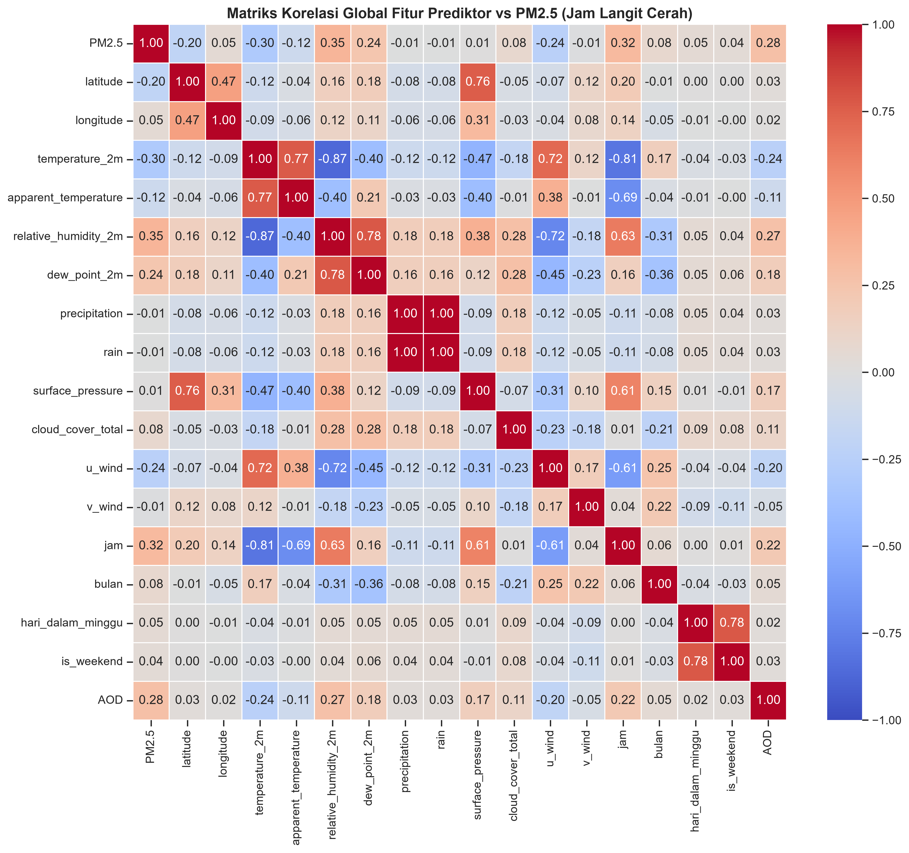

# Analisis Matriks Korelasi Global (Dataset Siap Latih)

Dokumen ini menganalisis hubungan korelasi spasial, temporal, dan meteorologi terhadap polusi PM2.5 di Jakarta berdasarkan matriks korelasi Pearson dari data langit cerah.

Visualisasi matriks korelasi yang dihasilkan dapat dilihat di bawah ini:

---

## 1. Korelasi Terhadap Variabel Target (PM2.5)

### 📈 Korelasi Positif
* **`relative_humidity_2m` (+0.35)** dan **`dew_point_2m` (+0.24)**:
  Menunjukkan korelasi positif sedang. Secara fisis, kelembapan udara yang tinggi di Jakarta mengikat partikel PM2.5 di udara dekat permukaan melalui efek pembengkakan higroskopis (*hygroscopic growth*), mencegah polutan terdispersi secara vertikal.
* **`jam` (+0.32)**:
  Jam harian memiliki hubungan positif yang signifikan dengan PM2.5. Hal ini disebabkan oleh fluktuasi harian emisi kendaraan (jam sibuk masuk/pulang kerja) serta naik-turunnya ketinggian lapisan batas atmosfer (*boundary layer*).
* **`AOD` (+0.28)**:
  Nilai ketebalan optik aerosol satelit memiliki korelasi positif sedang dengan PM2.5 darat. Korelasi positif ini membuktikan secara ilmiah bahwa satelit Himawari-9 AOD dapat digunakan sebagai prediktor spasial yang valid untuk mengestimasi PM2.5 permukaan tanah.

### 📉 Korelasi Negatif
* **`temperature_2m` (-0.30)** dan **`apparent_temperature` (-0.12)**:
  Suhu udara berkorelasi negatif sedang dengan PM2.5. Suhu panas di Jakarta (siang hari terik) memicu turbulensi termal dan ketidakstabilan atmosfer. Proses ini memicu konveksi udara yang mengangkat polutan PM2.5 ke lapisan atmosfer yang lebih tinggi (pengenceran konsentrasi di permukaan).
* **`u_wind` (-0.24)**:
  Komponen angin Timur-Barat (zonal). Nilai negatif menunjukkan korelasi terbalik dengan arah hembusan angin barat. Hembusan angin barat (yang membawa udara bersih dari laut Jawa) bertindak sebagai agen penyapu polutan alami yang menurunkan konsentrasi PM2.5 di Jakarta.
* **`latitude` (-0.20)**:
  Korelasi negatif dengan latitude menunjukkan stasiun yang berada di wilayah lebih selatan (koordinat latitude lebih negatif, seperti Jagakarsa di Jakarta Selatan) memiliki kecenderungan konsentrasi PM2.5 rata-rata yang lebih tinggi dibanding stasiun di utara.

---

## 2. Kolinearitas Antar Prediktor (Multicollinearity)

* **Suhu vs Kelembapan (`temperature_2m` vs `relative_humidity_2m` = -0.87)**:
  Terdapat hubungan terbalik yang sangat kuat antara suhu dan kelembapan. Hari yang panas berasosiasi dengan kelembapan yang rendah, dan sebaliknya.
* **Suhu vs Jam UTC (`temperature_2m` vs `jam` = -0.81)**:
  Korelasi negatif kuat ini merupakan karakteristik dari **format waktu UTC** yang digunakan pada API Open-Meteo.
  * UTC `00:00` (pukul 07:00 WIB) s.d. UTC `09:00` (pukul 16:00 WIB) adalah siang hari (suhu memuncak).
  * Seiring waktu UTC merangkak naik ke malam hari (UTC `12:00` s.d. `23:00` / 19:00 s.d. 06:00 WIB), suhu turun secara konstan ke titik terendah. Korelasi negatif ini mencerminkan transisi alami siklus suhu harian.

---

## 3. Kesimpulan Pemodelan
Matriks korelasi membuktikan bahwa data cuaca (`relative_humidity_2m`, `temperature_2m`, `u_wind`) dan data spasial (`latitude`, `AOD`) memuat sinyal prediktif yang kuat terhadap PM2.5. Kombinasi multivariabel ini akan memberikan informasi yang kaya bagi algoritma **Random Forest Regressor** untuk memetakan polusi secara spasial.
