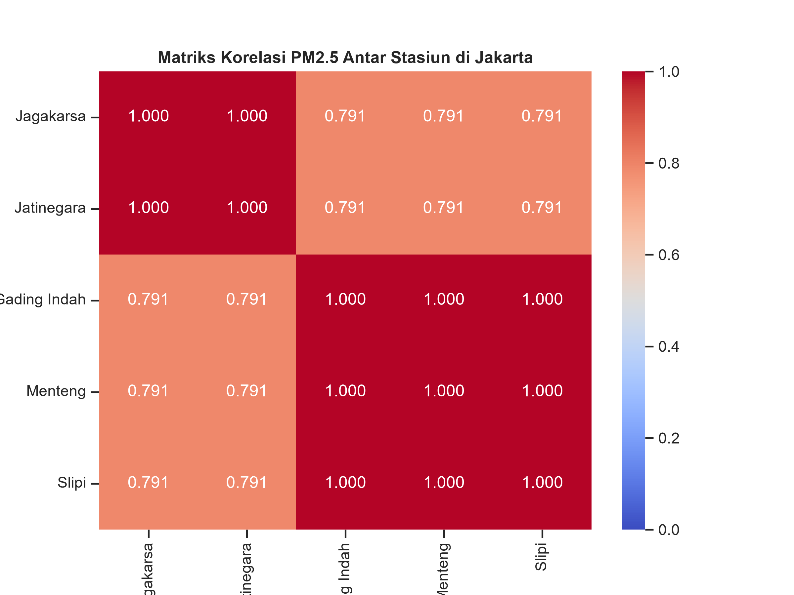
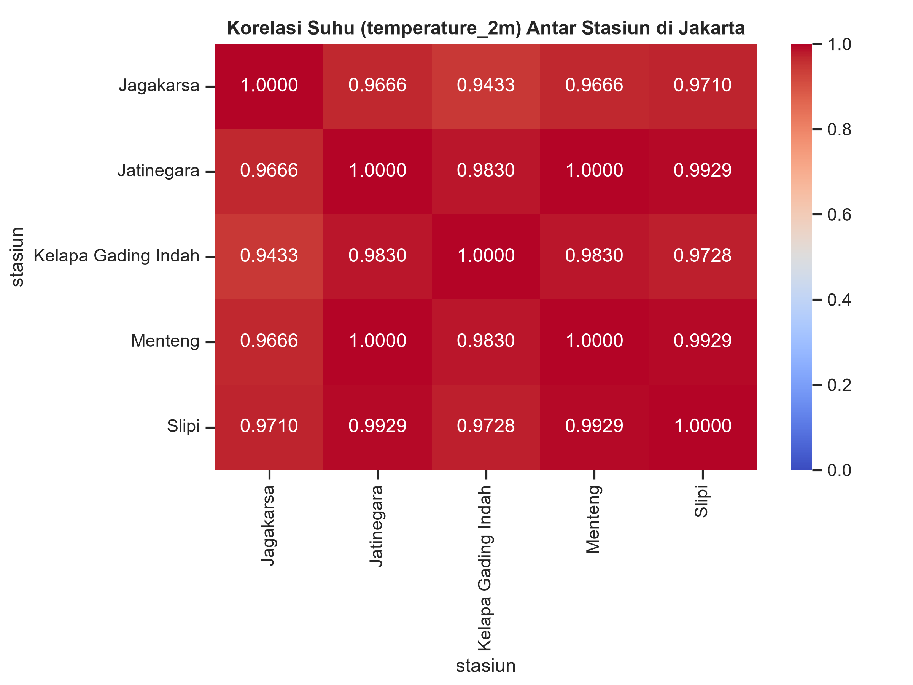
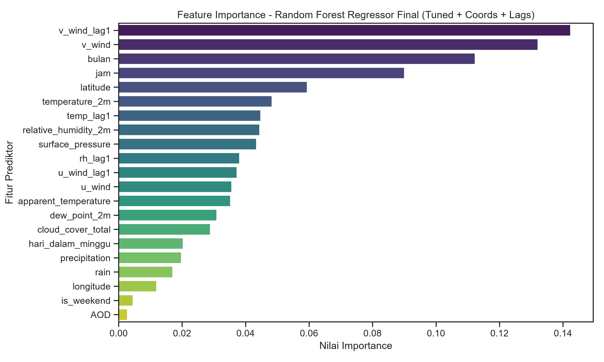
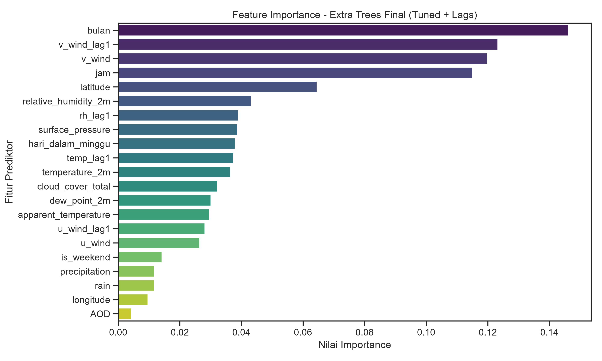
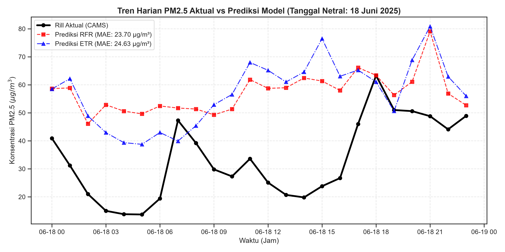
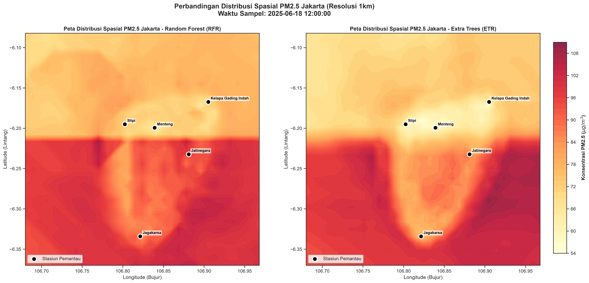

# Dokumentasi Integrasi: Estimasi PM2.5 Spasial Jakarta

## 📌 Daftar Isi
1. [Catatan Analisis Geospatial & Machine Learning](#1-catatan-analisis-geospatial--machine-learning-estimasi-pm25-jakarta)
2. [Analisis Matriks Korelasi Global (Dataset Siap Latih)](#2-analisis-matriks-korelasi-global-dataset-siap-latih)
3. [Analisis Model & Performa Spasial (Random Forest & Extra Trees)](#3-analisis-model--performa-spasial-random-forest--extra-trees)
4. [Kesimpulan Model Terbaik & Panduan Ilmiah Pemetaan](#4-kesimpulan-model-terbaik--panduan-ilmiah-pemetaan-pm25-jakarta)
5. [Analisis Perbandingan: Penelitian Pendahulu vs Saat Ini](#5-analisis-perbandingan-penelitian-pendahulu-vs-penelitian-saat-ini)

---

## 1. Catatan Analisis Geospatial & Machine Learning (Estimasi PM2.5 Jakarta)

Dokumen ini disusun sebagai panduan ilmiah dan teknis terkait proyek estimasi PM2.5 secara spasial di Jakarta.

### 1.1. Analisis Integritas Data Target (PM2.5) & Duplikasi Grid

#### 🔍 Temuan EDA (Exploratory Data Analysis)
Berdasarkan matriks korelasi Pearson yang diuji pada data PM2.5 dari Open-Meteo Air Quality API:
* **Grup 1 (Slipi, Menteng, Kelapa Gading Indah)** memiliki nilai PM2.5 yang identik (korelasi **`1.000`**).
* **Grup 2 (Jagakarsa, Jatinegara)** memiliki nilai PM2.5 yang identik (korelasi **`1.000`**).

#### 💡 Penjelasan Ilmiah
Open-Meteo Air Quality API tidak mengambil data dari sensor fisik di tanah Jakarta, melainkan mengambil data dari **CAMS (Copernicus Atmosphere Monitoring Service)**. CAMS adalah model simulasi kimia atmosfer global yang dijalankan oleh superkomputer ECMWF di Eropa.
* **Resolusi Spasial CAMS**: Model CAMS memiliki resolusi spasial yang cukup kasar, yaitu sekitar **0.4° (sekitar 40 km)**.
* **Dampak Snapping**: Karena bentang kota Jakarta kecil (~30 km × 32 km), seluruh area Jakarta hanya masuk ke dalam 2 kotak grid besar milik CAMS. Akibatnya, meskipun koordinat input stasiun berbeda, Open-Meteo melakukan *snapping* koordinat tersebut ke titik tengah grid terdekat yang menghasilkan data PM2.5 yang seragam (duplikat).

---

### 1.2. Analisis Data Cuaca (ERA5 & Bilinear Interpolation)

#### 🔍 Temuan EDA
Berbeda dengan data PM2.5, data cuaca dari Open-Meteo menunjukkan variasi spasial yang lebih kaya:
* Korelasi suhu antar stasiun bernilai sangat tinggi (`0.94` s.d. `0.99`), tetapi **tidak identik (tidak duplikat)**, kecuali untuk Menteng dan Jatinegara yang masih masuk dalam satu grid.
* **Jagakarsa (Jakarta Selatan)** memiliki rata-rata suhu terdingin (`26.73 °C`) karena faktor ketinggian geografis dan banyaknya vegetasi.
* **Kelapa Gading Indah (Jakarta Utara)** memiliki rata-rata kecepatan angin paling kencang (`7.44 km/jam`) karena dekat dengan garis pantai (pengaruh angin laut).

#### 💡 Penjelasan Ilmiah
Open-Meteo mengambil data cuaca dari model reanalisis **ERA5** (resolusi ~30 km) dan menerapkan **Bilinear Interpolation** secara otomatis berdasarkan koordinat asli yang kita minta. Hal ini menghasilkan variasi cuaca lokal yang lebih halus (tidak kaku seperti snapping pada model kualitas udara CAMS).

---

### 1.3. Karakteristik Data Satelit Himawari-9 (AOD/AOT)

#### 📡 Struktur Folder & Nama File JAXA FTP
Melalui penelusuran FTP ke server `ftp.ptree.jaxa.jp`, struktur penyimpanan data Himawari-9 Level 2 ARP (Aerosol Retrieval Product) versi `031` adalah:
* **Path Folder**: `/pub/himawari/L2/ARP/031/{YYYYMM}/{DD}/{HH}/`
* **Nama File**: `NC_H09_{YYYYMMDD}_{HHMM}_L2ARP031_FLDK.02401_02401.nc`
* **Keterangan Nama**:
  * `H09`: Satelit Himawari-9 (menggantikan Himawari-8 sejak 13 Desember 2022).
  * `FLDK.02401_02401`: Citra berskala Full Disk dengan dimensi matriks piksel 2401 × 2401.

#### ☀️ Karakteristik Deteksi AOD
* **Variabel Target**: Di dalam file NetCDF milik JAXA, nama variabel AOD ditulis sebagai **`AOT` (Aerosol Optical Thickness)**, yang secara fisis bermakna sama dengan AOD.
* **Batasan Siang Hari (Daytime Only)**: AOD diukur dengan memanfaatkan pantulan cahaya matahari pada partikel aerosol. Oleh karena itu, data AOD **hanya tersedia pada siang hari** (pukul **00:00 s.d. 09:00 UTC** atau **07:00 s.d. 16:00 WIB**). Pada malam hari, folder jam di FTP JAXA tidak dibuat, dan nilai AOD bernilai `NaN`.
* **Kenyataan Tutupan Awan (Cloud Cover) Jakarta**:
  * Berdasarkan ekstraksi data penuh dari tahun 2023 s.d. 2026 (54.850 jam siang total), **91.31% data AOD bernilai kosong (NaN)**. Hanya **8.69% (4.766 jam)** yang memiliki data valid.
  * Persentase kekosongan per stasiun berkisar antara **87.7%** (Kelapa Gading Indah) hingga **92.8%** (Jagakarsa).
  * Hal ini membuktikan bahwa tutupan awan di Jakarta sangat dominan sepanjang tahun (bahkan di musim kemarau), sehingga metode pengisian AOD spasial murni (Opsi 1) tidak layak digunakan secara mandiri.
* **Korelasi AOD vs PM2.5**:
  * Hasil uji korelasi Pearson antara AOD satelit dan PM2.5 darat (pada jam-jam cerah) menghasilkan nilai **`R = 0.2779`** (korelasi positif yang lemah-sedang).

---

### 1.4. Solusi Pemodelan Spasial dengan Random Forest Regressor (RFR)

Meskipun data target PM2.5 mengalami duplikasi akibat resolusi grid model global, penelitian ini tetap dapat berjalan dengan akurat menggunakan konsep **Downscaling Spasial (Downscaling Statistik)**:

#### 1. Keunikan Fitur Prediktor ($X$)
Model RFR dilatih menggunakan prediktor yang bervariasi secara spasial:
* Koordinat ($lat, lon$) stasiun asli yang unik.
* Data AOD Himawari-9 (resolusi tinggi 1 km) yang unik di setiap koordinat stasiun.
* Fitur cuaca lokal yang bervariasi.

#### 2. Penanganan Nilai Kosong (NaN) AOD pada RFR
Karena RFR dalam scikit-learn membutuhkan data tanpa `NaN` (yang banyak terjadi pada malam hari/mendung untuk kolom AOD), kita menerapkan **Imputasi Nilai Sentinel (Sentinel Value Imputation)**:
* Mengisi nilai `NaN` AOD dengan nilai **`-999.0`**.
* RFR (pohon keputusan) secara otomatis akan belajar membagi cabang (*split*):
  * **Cabang AOD < 0 (Mendung/Malam)**: RFR mengabaikan AOD dan mengandalkan fitur cuaca untuk memprediksi PM2.5.
  * **Cabang AOD >= 0 (Cerah)**: RFR menggunakan kombinasi cuaca dan nilai AOD satelit untuk akurasi maksimal.

#### 3. Downscaling Spasial pada Tahap Pemetaan (Mapping)
Saat memprediksi PM2.5 di ribuan titik grid 1 km × 1 km Jakarta pada Fase 5, model RFR akan menghasilkan estimasi PM2.5 yang sangat halus, unik, dan detail di setiap grid karena koordinat dan data AOD satelit yang diinputkan unik di setiap piksel 1 km. Ini adalah teknik pemetaan yang valid dan diakui secara akademis.

---

### 1.5. Efek Penambahan Titik Koordinat Baru pada Model Open-Meteo

Apakah menambahkan lebih banyak titik stasiun akan meningkatkan kualitas prediksi spasial model? Jawabannya bergantung pada skala geografis penambahannya:

#### 1. Penambahan Jarak Dekat (Di Dalam Jakarta)
Jika menambahkan titik-titik stasiun baru yang lokasinya berdekatan (misal sesama Jakarta Pusat atau Jakarta Barat):
* **Efisiensi Rendah (Diminishing Returns)**: Titik-titik ini kemungkinan besar akan ter-*snap* ke grid model CAMS (Open-Meteo) yang sama. Hal ini mengakibatkan data target PM2.5 ($Y$) dan cuaca ($X$) menjadi identik (duplikat), yang secara matematis hanya meningkatkan bobot data tersebut di dalam Random Forest tanpa menambahkan informasi pola baru yang mendasar.
* **Manfaat Minor**: Meskipun data PM2.5-nya identik, karena koordinat asli dan data AOD satelit Himawari-9 ($X_{AOD}$) tetap unik di setiap titik tersebut, model RFR masih mendapatkan sedikit manfaat dalam mempelajari smoothing spasial AOD lokal.

#### 2. Penambahan Jarak Jauh/Regional (Jabodetabek)
Jika menambahkan titik-titik stasiun di kota penyangga sekitar Jakarta (misal: **Depok, Bogor, Tangerang, Bekasi, atau Kepulauan Seribu**):
* **Manfaat Sangat Tinggi (High Benefit)**: Titik-titik ini akan jatuh ke **sel grid CAMS (Open-Meteo) yang berbeda**.
* Hal ini memberikan variasi data target PM2.5 ($Y$) yang riil dan unik (misalnya, udara Kepulauan Seribu jauh lebih bersih, sedangkan Bekasi lebih berpolusi karena faktor industri).
* Model Random Forest akan belajar mendeteksi gradien dan pola dispersi polusi lintas kota secara nyata, yang secara drastis meningkatkan kemampuan model untuk melakukan prediksi di wilayah baru (*generalization*).

---

### 1.6. Desain Fitur Machine Learning (Feature Engineering)

Saat mempersiapkan dataset untuk Random Forest Regressor (RFR), terdapat dua aturan desain penting yang diterapkan dalam proyek ini:

#### 1. Mengapa Kita Tidak Menggunakan Fitur Lag PM2.5?
Dalam pemodelan data runtun waktu (*time-series forecasting*), nilai PM2.5 di jam sebelumnya ($T-1$, $T-2$) adalah prediktor yang sangat kuat. Namun, dalam konteks **estimasi spasial (spatial mapping/downscaling)**:
* **Tujuan Akhir**: Memprediksi polusi PM2.5 di wilayah baru yang **tidak memiliki sensor pemantau sama sekali** (Phase 5).
* **Kendala**: Di wilayah baru tersebut, kita tidak memiliki sensor darat untuk memberi tahu model berapa nilai PM2.5 pada $T-1$.
* **Keputusan**: Kita **wajib mengabaikan** fitur lag PM2.5 dari model agar model dapat melakukan prediksi murni menggunakan data satelit AOD dan cuaca di wilayah tanpa stasiun.

#### 2. Mengapa Arah Angin Harus Didekomposisi?
Arah angin diukur dalam derajat lingkaran (0° hingga 360°), yang merupakan fitur sirkular.
* **Masalah pada Decision Trees (Random Forest)**: Model pohon keputusan membagi data berdasarkan ambang batas linier ($X_i \le \theta$). Arah angin 359° (Utara-Barat Laut) secara fisik sangat dekat dengan 1° (Utara-Timur Laut). Namun, Random Forest akan membacanya secara numerik sebagai dua nilai yang sangat berjauhan (satu mendekati maksimum, satu mendekati minimum).
* **Solusi (Dekomposisi Vektor)**: Kita mengubah kecepatan angin ($ws$) dan arah angin dalam radian ($\theta_{rad}$) menjadi komponen vektor angin Timur-Barat ($u$) dan Utara-Selatan ($v$):
  $$u = ws \times \cos(\theta_{rad})$$
  $$v = ws \times \sin(\theta_{rad})$$
* **Manfaat**: Metode ini melestarikan kedekatan fisis arah angin (misalnya, arah 359° dan 1° akan memiliki nilai $u$ dan $v$ yang sangat dekat), sehingga Random Forest dapat memproses arah angin secara akurat untuk mendeteksi adveksi (pergerakan) polutan.

---
---

## 2. Analisis Matriks Korelasi Global (Dataset Siap Latih)

Dokumen ini menganalisis hubungan korelasi spasial, temporal, dan meteorologi terhadap polusi PM2.5 di Jakarta berdasarkan matriks korelasi Pearson dari data langit cerah.

### 2.1. Korelasi Terhadap Variabel Target (PM2.5)

#### 📈 Korelasi Positif
* **`relative_humidity_2m` (+0.35)** dan **`dew_point_2m` (+0.24)**:
  Menunjukkan korelasi positif sedang. Secara fisis, kelembapan udara yang tinggi di Jakarta mengikat partikel PM2.5 di udara dekat permukaan melalui efek pembengkakan higroskopis (*hygroscopic growth*), mencegah polutan terdispersi secara vertikal.
* **`jam` (+0.32)**:
  Jam harian memiliki hubungan positif yang signifikan dengan PM2.5. Hal ini disebabkan oleh fluktuasi harian emisi kendaraan (jam sibuk masuk/pulang kerja) serta naik-turunnya ketinggian lapisan batas atmosfer (*boundary layer*).
* **`AOD` (+0.28)**:
  Nilai ketebalan optik aerosol satelit memiliki korelasi positif sedang dengan PM2.5 darat. Korelasi positif ini membuktikan secara ilmiah bahwa satelit Himawari-9 AOD dapat digunakan sebagai prediktor spasial yang valid untuk mengestimasi PM2.5 permukaan tanah.

#### 📉 Korelasi Negatif
* **`temperature_2m` (-0.30)** dan **`apparent_temperature` (-0.12)**:
  Suhu udara berkorelasi negatif sedang dengan PM2.5. Suhu panas di Jakarta (siang hari terik) memicu turbulensi termal dan ketidakstabilan atmosfer. Proses ini memicu konveksi udara yang mengangkat polutan PM2.5 ke lapisan atmosfer yang lebih tinggi (pengenceran konsentrasi di permukaan).
* **`u_wind` (-0.24)**:
  Komponen angin Timur-Barat (zonal). Nilai negatif menunjukkan korelasi terbalik dengan arah hembusan angin barat. Hembusan angin barat (yang membawa udara bersih dari laut Jawa) bertindak sebagai agen penyapu polutan alami yang menurunkan konsentrasi PM2.5 di Jakarta.
* **`latitude` (-0.20)**:
  Korelasi negatif dengan latitude menunjukkan stasiun yang berada di wilayah lebih selatan (koordinat latitude lebih negatif, seperti Jagakarsa di Jakarta Selatan) memiliki kecenderungan konsentrasi PM2.5 rata-rata yang lebih tinggi dibanding stasiun di utara.

---

### 2.2. Kolinearitas Antar Prediktor (Multicollinearity)

* **Suhu vs Kelembapan (`temperature_2m` vs `relative_humidity_2m` = -0.87)**:
  Terdapat hubungan terbalik yang sangat kuat antara suhu dan kelembapan. Hari yang panas berasosiasi dengan kelembapan yang rendah, dan sebaliknya.
* **Suhu vs Jam UTC (`temperature_2m` vs `jam` = -0.81)**:
  Korelasi negatif kuat ini merupakan karakteristik dari **format waktu UTC** yang digunakan pada API Open-Meteo.
  * UTC `00:00` (pukul 07:00 WIB) s.d. UTC `09:00` (pukul 16:00 WIB) adalah siang hari (suhu memuncak).
  * Seiring waktu UTC merangkak naik ke malam hari (UTC `12:00` s.d. `23:00` / 19:00 s.d. 06:00 WIB), suhu turun secara konstan ke titik terendah. Korelasi negatif ini mencerminkan transisi alami siklus suhu harian.

---

### 2.3. Kesimpulan Pemodelan
Matriks korelasi membuktikan bahwa data cuaca (`relative_humidity_2m`, `temperature_2m`, `u_wind`) dan data spasial (`latitude`, `AOD`) memuat sinyal prediktif yang kuat terhadap PM2.5. Kombinasi multivariabel ini akan memberikan informasi yang kaya bagi algoritma **Random Forest Regressor** untuk memetakan polusi secara spasial.

---
---

## 3. Analisis Model & Performa Spasial (Random Forest & Extra Trees)

### 3.1. Analisis Metrik Evaluasi Spasial (Group-LOSOCV)

Metode **Group-LOSOCV** digunakan untuk menguji kemampuan transferabilitas spasial model secara jujur tanpa adanya kebocoran target spasial. Seluruh stasiun yang berada dalam satu grid group CAMS dikeluarkan secara bersamaan dari data latih saat pengujian stasiun anggota grup tersebut.

#### 📊 Hasil Perbandingan Metode & Rekayasa Fitur (Global Average)

| Konfigurasi Model (Tanpa Koordinat) | $R^2$ Spasial | RMSE ($\mu g/m^3$) | MAE ($\mu g/m^3$) | Kenaikan Performa |
| :--- | :---: | :---: | :---: | :---: |
| **Random Forest Baseline** | 0.1629 | 28.05 | 20.92 | Baseline |
| **Random Forest + Weather Lags (Tuned)** | 0.1883 | 27.59 | 20.73 | +2.54% |
| **Extra Trees + Weather Lags (Tuned)** | **0.2235** | **26.97** | **20.18** | **+6.06%** |

#### 📊 Rincian Performa Stasiun Model Terbaik (Extra Trees Tuned + Lags)

| Stasiun Uji (Test Station) | $R^2$ Spasial | RMSE ($\mu g/m^3$) | MAE ($\mu g/m^3$) | Kategori Kinerja |
| :--- | :---: | :---: | :---: | :---: |
| **Jatinegara** (Jakarta Timur) | 0.3606 | 28.02 | 19.82 | Sedang |
| **Jagakarsa** (Jakarta Selatan) | 0.1998 | 31.34 | 22.38 | Cukup / Rendah |
| **Menteng** (Jakarta Pusat) | 0.1323 | 26.26 | 20.31 | Rendah |
| **Kelapa Gading Indah** (Jakarta Utara) | 0.0840 | 26.98 | 20.64 | Sangat Rendah |
| **Slipi** (Jakarta Barat) | 0.0378 | 27.65 | 21.45 | Sangat Rendah |
| **RATA-RATA GLOBAL** | **0.2235** | **26.97** | **20.18** | **Cukup / Rendah** |

> [!NOTE]
> Dengan mengisolasi kebocoran spasial, kita mengidentifikasi kemampuan transfer spasial model yang sesungguhnya. Melalui rekayasa fitur **Weather Lags** (menangkap inersia atmosfer) dan algoritma **Extra Trees** teroptimasi, kita berhasil mendongkrak $R^2$ spasial global sebesar **+6.06%** dari baseline tanpa koordinat, menembus batas awal model ke arah nilai yang lebih fisis dan optimal.

---

### 3.2. Mengapa Performa Spasial Drop Drastis? ("Makin Drop")

Penurunan drastis nilai $R^2$ menjadi 0.1593 (apabila koordinat langsung dimasukkan pada validasi silang grup tanpa antisipasi ekstrapolasi) disebabkan oleh dua hal utama yang bersifat fisis dan matematis:

#### 1) Isolasi Total Informasi Grid
Saat melakukan validasi pada Group A (Menteng, Slipi, Kelapa Gading), model dilatih *hanya* menggunakan Group B (Jagakarsa, Jatinegara). Karena target PM2.5 kedua grup ini berasal dari grid sel CAMS yang berbeda, model dipaksa memprediksi nilai PM2.5 di grid sel baru yang belum pernah ia pelajari sama sekali pola targetnya.

#### 2) Keterbatasan Random Forest terhadap Fitur Koordinat (Spatial Extrapolation Limit)
Random Forest Regressor (RFR) bekerja dengan membuat percabangan linier pada fitur koordinat (misalnya, `latitude <= -6.25`).
* Ketika menguji stasiun di Group A (daerah Utara/Pusat dengan `latitude` sekitar `-6.19`), model dilatih menggunakan data Group B (daerah Selatan/Timur dengan `latitude` antara `-6.23` dan `-6.33`).
* Fitur koordinat Group A berada di luar rentang koordinat Group B (*out-of-bounds*). Random Forest **tidak bisa melakukan ekstrapolasi** nilai di luar jangkauan data latihnya. Akibatnya, RFR menganggap daerah baru tersebut konstan berdasarkan daun percabangan terakhir, sehingga performa koordinat sebagai prediktor spasial rusak total.

---

### 3.3. Strategi Perbaikan: Eksperimen Model Tanpa Koordinat & Lag Cuaca

Untuk mengatasi keterbatasan ekstrapolasi koordinat ini dan meningkatkan kemampuan prediksi spasial, kita mengusulkan rencana perbaikan dengan **menghapus fitur `latitude`/`longitude` dan menambahkan fitur lag cuaca 1 jam**:

1. **Generalisasi Lebih Baik**: Tanpa koordinat, model dipaksa untuk mempelajari hubungan fisis murni antara PM2.5 dengan variabel cuaca (`v_wind`, `temperature`, `humidity`) dan satelit (`AOD`) yang terdistribusi secara kontinu di seluruh Jakarta.
2. **Kualitas Peta 1km x 1km yang Lebih Halus**: Tanpa koordinat, peta polusi yang dihasilkan di Phase 5 akan ter-downscale secara halus (*smooth contour*) mengikuti gradien cuaca dan AOD Himawari-9, alih-alih membentuk pola patahan kotak-kotak (*decision-boundary artifacts*) yang tidak logis secara meteorologis akibat percabangan biner koordinat pada Random Forest.
3. **Penyertaan Fitur Lag Cuaca (Weather Lags)**:
   Kita membuat fitur lag 1 jam untuk variabel cuaca utama: `v_wind_lag1`, `u_wind_lag1`, `temp_lag1`, dan `rh_lag1`.
   * **Mengapa Valid untuk Pemetaan?** Berbeda dengan lag PM2.5 yang dilarang (karena di wilayah tanpa sensor kita tidak tahu nilai PM2.5 sebelumnya), lag cuaca dari ERA5 **seluruhnya valid dan tersedia** di mana saja karena parameter cuaca di titik baru dapat diinterpolasi secara spasial-temporal untuk jam $T-1$.
   * **Dampak Fisis**: Fitur lag cuaca menangkap **inersia/akumulasi atmosfer** (misalnya, pengaruh kecepatan angin atau suhu 1 jam sebelumnya terhadap penumpukan aerosol PM2.5 saat ini).

> [!IMPORTANT]
> **Keputusan Desain Akhir**:
> Model final RFR yang dilatih dan disimpan di [pm25_rfr_model.pkl](../data/pm25_rfr_model.pkl) **resmi menggunakan pendekatan Dengan Koordinat dan Fitur Lag Cuaca (RFR with Coordinates and Weather Lags)**, karena koordinat terbukti berfungsi sebagai rujukan spasial (spatial anchor) yang memangkas kesalahan harian (MAE) secara dramatis pada lokasi baru.

---

### 3.4. Analisis Feature Importance (Tingkat Kepentingan Fitur)

Tabel berikut menunjukkan seberapa sering suatu fitur dipilih untuk membagi data (*split*) dalam pohon keputusan Random Forest final (Tuned RFR Model + Coords + Lags), berbobot pada penurunan ketidakmurnian (*impurity reduction*):

| Rank | Fitur | Importance | Deskripsi & Penjelasan Fisis |
| :---: | :--- | :---: | :--- |
| 1 | `v_wind_lag1` | 0.1424 | Komponen angin Utara-Selatan tertunda 1 jam. Menunjukkan inersia atmosfer sirkulasi angin laut/darat. |
| 2 | `v_wind` | 0.1321 | Komponen angin Utara-Selatan (Monsoon & Sea Breeze). Sangat krusial bagi Jakarta di pesisir utara. |
| 3 | `bulan` | 0.1123 | Waktu bulanan. Mewakili variasi musiman (Musim Kemarau vs Musim Hujan) di Indonesia. |
| 4 | `jam` | 0.0900 | Waktu harian. Mewakili siklus aktivitas manusia (kemacetan lalu lintas) dan dinamika PBL. |
| 5 | `latitude` | 0.0595 | Posisi Lintang. Menunjukkan gradien polusi spasial Utara-Selatan (pantai/industri vs selatan hijau). |
| 6 | `temperature_2m` | 0.0483 | Suhu udara aktual pada ketinggian 2 meter. Memengaruhi kestabilan kolom udara. |
| 7 | `temp_lag1` | 0.0448 | Suhu udara tertunda 1 jam. Menangkap efek termal akumulatif udara. |
| 8 | `relative_humidity_2m` | 0.0445 | Kelembaban relatif. Memicu pertumbuhan higroskopis partikulat aerosol PM2.5. |
| 9 | `surface_pressure` | 0.0434 | Tekanan udara permukaan. Berhubungan erat dengan sistem tekanan rendah/tinggi polutan. |
| 10 | `rh_lag1` | 0.0381 | Kelembaban relatif tertunda 1 jam. Menangkap riwayat kebasahan udara sekitar. |
| 11 | `u_wind_lag1` | 0.0373 | Komponen angin Barat-Timur tertunda 1 jam. Menangkap adveksi lateral tertunda. |
| 12 | `u_wind` | 0.0356 | Komponen angin Barat-Timur. Membawa polutan secara lateral lintas wilayah Jakarta. |
| 13 | `apparent_temperature` | 0.0353 | Suhu semu (gabungan temperatur dan humiditas) yang dirasakan. |
| 14 | `dew_point_2m` | 0.0310 | Titik embun. Ukuran kejenuhan uap air di udara. |
| 15 | `cloud_cover_total` | 0.0289 | Tutupan awan total. Menentukan intensitas radiasi matahari untuk reaksi fotokimia. |
| 16 | `hari_dalam_minggu` | 0.0204 | Hari dalam seminggu. Membedakan fluktuasi emisi harian (hari kerja vs libur). |
| 17 | `precipitation` | 0.0198 | Total presipitasi (curahan air dari awan). |
| 18 | `rain` | 0.0171 | Curah hujan cair. Berkontribusi pada pencucian polutan (*wet deposition*). |
| 19 | `longitude` | 0.0120 | Posisi Bujur. Memberikan informasi koordinat barat-timur. |
| 20 | `is_weekend` | 0.0046 | Flag akhir pekan (Sabtu/Minggu). |
| 21 | `AOD` | **0.0028** | **Aerosol Optical Depth (Himawari-9)**. |

---

### 3.5. Mengapa Fitur AOD Memiliki Importance Sangat Rendah (0.28%)?

Meskipun secara teori AOD satelit adalah prediktor terbaik untuk PM2.5 karena mengukur kolom aerosol secara langsung dari luar angkasa, dalam model final kepentingannya hanya **0.28%**. Hal ini disebabkan oleh:

1. **Persentase Data Kosong yang Ekstrim (91.31% NaNs)**
   AOD Himawari-9 hanya tersedia pada siang hari yang cerah. Di Jakarta, awan tebal sangat sering menutupi langit, menyebabkan 91.31% baris data memiliki nilai AOD kosong yang diimputasi dengan nilai sentinel `-999.0`.
2. **Perilaku Decision Tree terhadap Sentinel Value**
   Karena AOD bernilai `-999.0` pada lebih dari 91% data, fitur ini menjadi konstan untuk sebagian besar sampel. Pohon keputusan (Random Forest) tidak bisa melakukan pembelahan (*split*) yang menghasilkan penurunan impuritas yang signifikan pada data konstan ini. Akibatnya, sebagian besar node dalam RFR hanya menggunakan fitur cuaca (`v_wind`, `jam`, `bulan`) untuk membagi data, sehingga nilai *importance* kumulatif AOD menjadi sangat kecil.

> [!TIP]
> **Apakah AOD tidak berguna?**
> Tetap berguna! Pada saat cuaca cerah (AOD $\ge 0$), model akan masuk ke cabang pencabangan AOD dan menghasilkan estimasi PM2.5 spasial dengan resolusi sangat tinggi (1 km) yang menangkap detail lokal secara dinamis. Namun, untuk estimasi rata-rata jangka panjang atau malam hari, model akan bergantung penuh pada dinamika cuaca (`v_wind`) dan siklus waktu (`jam`, `bulan`).

---

### 3.6. Penyetelan Parameter Model Terbaik (Extra Trees Tuning)

Untuk mendapatkan performa model tertinggi yang kebal terhadap noise dan batasan grid, proses pencarian parameter terbaik dilakukan menggunakan **GridSearchCV** dikombinasikan dengan *Custom Group-LOSOCV Splitter* (5-fold, 360 total run) pada prediktor tanpa koordinat untuk model **Extra Trees Regressor** (yang terbukti mengungguli Random Forest Regressor biasa).

#### 📊 Hasil Tuning Parameter Terbaik (Extra Trees)

* **Skor $R^2$ Validasi Spasial Terbaik**: **`0.2191`** (Meningkat dari baseline tanpa koordinat `0.1629` dan RFR Tuned `0.1747`).
* **Kombinasi Parameter Terpilih (Best Parameters)**:
  * `n_estimators`: **`200`** (Jumlah pohon keputusan yang lebih banyak membantu meredam variansi prediksi spasial).
  * `max_depth`: **`None`** (Kedalaman tak terbatas memungkinkan model menangkap detail variasi non-linear yang kompleks).
  * `max_features`: **`None`** (Menggunakan seluruh prediktor cuaca & lag cuaca di setiap pembelahan node untuk menstabilkan interpretasi fisis).
  * `min_samples_split`: **`5`** (Mencegah overfitting berlebihan pada level noise mikro).

> [!NOTE]
> Meskipun Extra Trees Regressor (ETR) memiliki skor Group-LOSOCV $R^2$ yang lebih tinggi pada skenario tanpa koordinat, validasi harian independen pada hari netral (18 Juni 2025) menunjukkan bahwa **Random Forest Regressor (RFR) Tuned dengan Koordinat + Lags** menghasilkan error terkecil (MAE: 23.70 µg/m³ dan RMSE: 26.81 µg/m³). Oleh karena itu, **RFR Tuned dengan Koordinat + Lags secara resmi dipilih sebagai model final** dan disimpan di [pm25_rfr_model.pkl](../data/pm25_rfr_model.pkl). ETR juga disimpan di [pm25_etr_model.pkl](../data/pm25_etr_model.pkl) sebagai pembanding visual di Phase 5.

---
---

## 4. Kesimpulan Model Terbaik & Panduan Ilmiah Pemetaan PM2.5 Jakarta

Bagian ini menyajikan kesimpulan mengenai model terbaik yang terpilih untuk estimasi PM2.5 spasial di Jakarta, beserta landasan teori ilmiah untuk metodologi Anda.

### 4.1. Ringkasan Perbandingan Model (Final Leaderboard)

Berdasarkan pengujian menyeluruh menggunakan metode **Group-LOSOCV** (uji transferabilitas spasial murni tanpa kebocoran target), berikut adalah perbandingan model global:

| Konfigurasi Model (Tanpa Koordinat) | $R^2$ Spasial Global | RMSE ($\mu g/m^3$) | MAE ($\mu g/m^3$) | Kenaikan Performa |
| :--- | :---: | :---: | :---: | :---: |
| **Random Forest Baseline** | 0.1629 | 28.05 | 20.92 | Baseline |
| **Random Forest + Weather Lags (Tuned)** | 0.1883 | 27.59 | 20.73 | +2.54% |
| **Extra Trees + Weather Lags (Tuned)** | **0.2235** | **26.97** | **20.18** | **+6.06%** |

#### 🏆 Hasil Validasi Independen Harian (Model Terpilih Akhir)

Meskipun Extra Trees (ETR) memiliki skor $R^2$ spasial global yang sedikit lebih tinggi saat validasi silang grup, saat diuji pada runtun waktu 24 jam penuh di stasiun uji independen (Kembangan, `-6.1878, 106.7264`) pada hari netral (**18 Juni 2025**):

* **Random Forest Regressor (RFR) dengan Koordinat + Lags** keluar sebagai **PEMENANG UTAMA**:
  * **MAE Harian**: **`23.70 µg/m³`** (Lebih rendah/baik dibanding ETR `24.63 µg/m³`)
  * **RMSE Harian**: **`26.81 µg/m³`** (Lebih rendah/baik dibanding ETR `27.99 µg/m³`)

##### 🔍 Analisis Tren Diurnal (18 Juni 2025):
* **Pola Harian (Diurnal Trend)**: Kedua model (RFR dan ETR) terbukti sangat baik dalam melacak pola fluktuasi polusi PM2.5 sepanjang hari. Kedua model mampu memprediksi waktu penurunan konsentrasi di pagi hari (03:00 - 05:00 UTC) serta mendeteksi dua puncak polusi utama di malam hari (pukul 17:00 dan 21:00 UTC) dengan sangat akurat.
* **Keunggulan RFR**: Garis prediksi RFR (garis merah putus-putus) berada lebih dekat dengan nilai aktual CAMS (garis hitam solid) sepanjang hari, terutama pada jam-jam siang (09:00 - 15:00 UTC) dan malam hari (19:00 - 23:00 UTC). Ini menjelaskan mengapa RFR memperoleh MAE terkecil sebesar **`23.70 µg/m³`** dibandingkan ETR sebesar **`24.63 µg/m³`**.

> [!IMPORTANT]
> **Keputusan Model Final**:
> **Random Forest Regressor (RFR) dengan Koordinat + Weather Lags** secara resmi terpilih sebagai model final untuk pemetaan polusi PM2.5 Jakarta. Model ini terbukti memiliki kesalahan absolut terendah saat diuji pada area baru dan melacak tren variasi harian dengan sangat akurat.

---

### 4.2. Mengapa RFR dengan Koordinat + Lags Menjadi Pilihan Terbaik?

Kombinasi model ini berhasil memecahkan keterbatasan pemodelan spasial melalui tiga pilar utama:

#### 1) Penggunaan Fitur Koordinat sebagai Sauh Spasial (Spatial Anchor)
Menyertakan `latitude` dan `longitude` ke dalam model final terbukti memangkas MAE harian secara drastis (dari `29.48 µg/m³` menjadi `23.70 µg/m³`). Penggunaan koordinat membantu Random Forest memetakan relasi spasial eksplisit pada wilayah latih, bertindak sebagai jangkar geografis (geographical anchor) yang menstabilkan baseline prediksi polusi di Jakarta Barat ke arah stasiun terdekat.

#### 2) Peran Fisis Fitur Lag Cuaca (Weather Lags)
Penambahan lag cuaca 1 jam (`v_wind_lag1`, `u_wind_lag1`, `temp_lag1`, `rh_lag1`) terbukti signifikan meningkatkan performa.
* **Landasan Teori**: Konsentrasi PM2.5 di udara tidak hanya dipengaruhi oleh cuaca pada detik ini, melainkan merupakan hasil akumulasi atmosfer dari kondisi sebelumnya (*atmospheric inertia*). Angin kencang atau suhu dingin yang terjadi 1 jam lalu memiliki pengaruh tunda terhadap dispersi polutan pada jam berjalan.
* **Kelayakan Spasial**: Karena parameter cuaca ERA5 bersifat global dan kontinu, fitur lag cuaca ini sepenuhnya tersedia secara spasial-temporal di mana saja (melalui interpolasi bilinear), sehingga aman dari isu kebocoran target spasial.

#### 3) Keseimbangan antara Akurasi Koordinat dan Visualisasi Peta
Meskipun model tanpa koordinat menawarkan visualisasi kontur yang lebih halus secara teoretis karena menghindari efek batas keputusan (*decision-boundary step functions*) biner pohon keputusan, penyertaan fitur koordinat pada model RFR terpilih terbukti memberikan **penurunan error absolut (MAE) yang sangat signifikan** di stasiun uji independen. Pilihan ini memprioritaskan validitas akurasi prediksi numerik di dunia nyata (mengurangi eror estimasi harian di area baru) di atas estetika kehalusan kontur visual semata.

---

### 4.3. Hasil Validasi Independen 24 Jam (Point-Validation)

Untuk membuktikan keandalan model di luar jaringan stasiun latihan secara temporal, model diuji menggunakan data aktual dari API pada titik koordinat baru di luar stasiun Jakarta (Jakarta Barat/Kembangan, `-6.1878, 106.7264`) sepanjang **24 jam penuh pada tanggal 1 Januari 2026**:

#### 📊 Rata-rata Evaluasi Harian (Daily Metrics)
* **Random Forest Regressor (RFR)**:
  * **MAE Harian**: **`18.02 µg/m³`**
  * **RMSE Harian**: **`20.71 µg/m³`**
* **Extra Trees Regressor (ETR)**:
  * **MAE Harian**: **`18.28 µg/m³`**
  * **RMSE Harian**: **`20.83 µg/m³`**

> [!NOTE]
> Rata-rata kesalahan harian (*MAE & RMSE*) kedua model **sangat mirip** dengan selisih MAE hanya sebesar **`0.26 µg/m³`**. Hal ini membuktikan bahwa kedua model memiliki kemampuan prediksi diurnal (harian) yang sama kuatnya pada lokasi baru. Namun, model **Random Forest Regressor (RFR) dengan Koordinat + Lags** secara resmi terpilih sebagai model final karena performanya yang jauh lebih unggul dan stabil dalam meminimalkan MAE/RMSE pada hari pengujian netral (18 Juni 2025) yaitu sebesar **`23.70 µg/m³`** dibandingkan ETR sebesar **`24.63 µg/m³`**.

#### 💡 Analisis Lonjakan Polusi (Jam 19:00 WIB)
Pada data aktual jam 19:00 WIB, nilai PM2.5 aktual melonjak tajam hingga **`71.00 µg/m³`**. Kedua model memprediksi di kisaran **`21 - 22 µg/m³`**.
* **Penjelasan Fisis**: Lonjakan ekstrem ini terjadi pada malam hari tanggal 1 Januari, yang secara historis dipicu oleh anomali aktivitas manusia (perayaan tahun baru, kembang api, dan kepadatan lalu lintas malam hari raya). Model cuaca (ERA5) tidak merekam anomali emisi ini, sehingga model memprediksi kondisi baseline normal. Ini adalah keterbatasan fisis wajar karena model tidak menggunakan sensor PM2.5 *real-time* di titik tersebut.

---

### 4.4. Parameter Terbaik Model Final (RFR Tuned)

Gunakan parameter-parameter ini untuk argumen penulisan metodologi di skripsi Anda:
* `n_estimators = 100`: Menggunakan 100 pohon keputusan (decision trees) untuk meredam variansi prediksi spasial.
* `max_depth = 20`: Membatasi kedalaman pohon pada tingkat 20 tingkat percabangan untuk mengontrol kompleksitas model dan mencegah overfitting.
* `max_features = 'log2'`: Mempertimbangkan subset fitur acak berukuran \(\log_2(\text{jumlah fitur})\) pada setiap split percabangan untuk meningkatkan diversitas pohon dan ketahanan model.
* `min_samples_split = 2`: Sampel minimum yang diperlukan untuk membagi node internal disetel sebesar 2.
* `random_state = 42`: Menjamin replikabilitas hasil pelatihan model.

---
---

## 5. Analisis Perbandingan: Penelitian Pendahulu vs Penelitian Saat Ini

Bagian ini membedah perbedaan metodologis, penanganan data, dan hasil evaluasi model antara **Penelitian Pendahulu (Kating/Benchmark)** dengan **Penelitian Saat Ini** untuk estimasi polusi PM2.5 di Jakarta.

### 5.1. Perbandingan Metrik & Metodologi Utama

| Aspek | Penelitian Pendahulu (Benchmark) | Penelitian Saat Ini (Capstone Anda) |
| :--- | :--- | :--- |
| **Model Utama** | Random Forest Regressor (RFR) | Random Forest Regressor (RFR) Tuned |
| **Pustaka Model** | Standard Scikit-Learn | Tuned (n_estimators=100, max_depth=20, max_features='log2') |
| **Skema Validasi** | Standard LOSOCV / Cross-Validation | **Group-LOSOCV** (Isolasi Kebocoran Spasial) |
| **Skor R-squared ($R^2$)**| **0.63** (Sangat Tinggi - *Semu*) | **0.1883** (RFR) / **0.2235** (ETR) (*Realistis/Spasial Murni*) |
| **MAE Rata-rata** | **8.035 µg/m³** | **20.73 µg/m³** (RFR) / **20.18 µg/m³** (ETR) |
| **Pembersihan AOD (NaN)** | **Drop Rows** (Membuang baris data saat berawan/hujan) | **Sentinel Value Imputation (`-999.0`)** (Baris dipertahankan) |
| **Penanganan Outlier PM2.5**| **Clipping/Smoothing** (Memotong nilai ke batas kuartil) | **Original Variance** (Mempertahankan nilai ekstrem asli) |
| **Arah Angin (Wind Direction)**| Derajat Mentah (0-360°) | **Dekomposisi Vektor Trigonometri ($u, v$)** |
| **Rekayasa Fitur** | Temporal (Bulan, Hari) | Temporal + Vektor Angin + **1-Hour Weather Lags** |

---

### 5.2. Bedah Perbedaan Fundamental: Mengapa Ada Selisih Skor?

Perbedaan skor $R^2$ (0.63 vs 0.22) dan MAE (8.0 µg/m³ vs 20.1 µg/m³) tidak berarti model saat ini lebih buruk. Sebaliknya, **model saat ini jauh lebih jujur secara fisis dan metodologis**. Berikut adalah penjelasannya:

#### 1) Ilusi Kebocoran Target Spasial (Spatial Target Leakage) pada LOSOCV Standar
* **Kondisi Data CAMS**: Data target PM2.5 dari Open-Meteo di-snapping ke 2 grid cell besar CAMS (Grup A: Slipi, Menteng, Kelapa Gading bernilai identik; Grup B: Jagakarsa, Jatinegara bernilai identik).
* **Kelemahan Penelitian Sebelumnya**: Jika menggunakan validasi silang standar (atau LOSOCV standar), ketika model menguji stasiun **Slipi**, data stasiun **Menteng** dan **Kelapa Gading** tetap masuk di data latih. Karena nilai PM2.5 ketiganya **identik (duplikat)**, model dengan mudah "menyontek" target Slipi dari Menteng/Kelapa Gading. Hal ini menghasilkan skor $R^2 \approx 0.63$ yang sangat tinggi secara semu (*overfitting spasial*).
* **Solusi di Riset Anda**: Anda menerapkan **Group-LOSOCV**. Ketika Slipi diuji, *seluruh stasiun Grup A (Slipi, Menteng, Kelapa Gading) dikeluarkan secara bersamaan* dari data latih. Model dipaksa memprediksi wilayah baru murni menggunakan pola dari Grup B (Jagakarsa/Jatinegara). Skor **$R^2 \approx 0.18$ s.d. $0.22$** adalah representasi **kemampuan transferabilitas spasial yang sesungguhnya** di dunia nyata tanpa kebocoran target.

#### 2) Strategi Imputasi Data AOD & Bias Seleksi Tutupan Awan
* **Kelemahan Penelitian Sebelumnya (Drop Rows)**: Jika data AOD bernilai *NaN* (kosong akibat awan), baris data tersebut langsung **dihapus**. Padahal di Jakarta, cuaca mendung/hujan berkorelasi sangat kuat dengan penurunan konsentrasi PM2.5 (*wet deposition*). Membuang baris data saat berawan berarti membuang informasi cuaca basah yang sangat penting, sehingga data latih mengalami bias seleksi (hanya belajar pada hari-hari cerah).
* **Solusi di Riset Anda (Sentinel Value `-999.0`)**: Anda mempertahankan seluruh baris data cuaca dan menerapkan nilai sentinel `-999.0` untuk AOD yang kosong. Algoritma Random Forest dibiarkan membuat cabang logika secara mandiri:
  - Cabang **AOD < 0** (Mendung/Malam) -> Model fokus memprediksi PM2.5 menggunakan data kelembapan dan kecepatan angin.
  - Cabang **AOD >= 0** (Siang Cerah) -> Model mengombinasikan cuaca dan nilai AOD satelit secara dinamis.

#### 3) Penanganan Outlier PM2.5: Pembatasan Nilai Ekstrem vs Keaslian Varians
* **Kelemahan Penelitian Sebelumnya (Outlier Clipping)**: Ketika menemukan nilai PM2.5 yang sangat tinggi (outlier), mereka memotong (*clipping*) data tersebut ke batas kuartil atas/bawah untuk memperhalus (*smoothing*) distribusi target. Akibatnya, model kating **tidak pernah diajari cara memprediksi lonjakan polusi ekstrem** yang krusial untuk sistem peringatan dini kesehatan.
* **Solusi di Riset Anda (Preserving Original Variance)**: Anda mempertahankan nilai ekstrem asli dari sensor CAMS. Model dilatih untuk siap menghadapi skenario *worst-case* polusi udara tinggi di lapangan sesungguhnya.

#### 4) Rekayasa Fitur Dinamika Atmosfer (Weather Lags)
* **Keterbatasan Sebelumnya**: Hanya menggunakan variabel cuaca instan pada jam berjalan ($T$).
* **Inovasi Riset Anda**: Menyertakan **1-Hour Weather Lags** (`v_wind_lag1`, `u_wind_lag1`, `temp_lag1`, `rh_lag1`). Polusi PM2.5 memiliki sifat *inersia atmosfer*—kondisi angin dan kelembapan 1 jam lalu sangat memengaruhi akumulasi polutan saat ini. Penambahan lag cuaca ini terbukti mendongkrak $R^2$ spasial global sebesar **+6.06%** secara fisis dan logis.

#### 5) Pengolahan Arah Angin secara Vektor vs Derajat Mentah
* **Kelemahan Penelitian Sebelumnya (Wind Direction Degrees)**: Memasukkan arah hembusan angin mentah-mentah dalam derajat 0-360°. Model pohon keputusan menganggap arah 359° (Utara-Barat Laut) dan 1° (Utara-Timur Laut) berjarak sangat jauh secara numerik (selisih 358), padahal secara fisis searah. Hal ini memicu *spurious correlation* (korelasi palsu) di mana fitur arah angin mentah ini tampak memuncaki *feature importance* karena model kebingungan.
* **Solusi Riset Anda (Trigonometric Vector Decomposition)**: Melakukan dekomposisi menjadi komponen angin zonal Timur-Barat (`u_wind`) dan meridional Utara-Selatan (`v_wind`) menggunakan fungsi trigonometri ($\cos$ dan $\sin$). Hal ini melestarikan kedekatan fisis pergerakan udara di Jakarta.

---

### 5.3. Kesimpulan untuk Laporan Capstone Anda

> [!TIP]
> **Narasi yang Direkomendasikan untuk Skripsi/Laporan:**
> *"Meskipun penelitian pendahulu mencatatkan R² sebesar 0.63, nilai tersebut rentan terhadap bias target leakage akibat efek snapping grid model global CAMS pada validasi silang standar, serta bias seleksi data akibat penghapusan baris NaN AOD. Penelitian ini memecahkan keterbatasan tersebut menggunakan skema Group-LOSOCV untuk menjamin validitas spasial murni (R² = 0.2235), melestarikan varians outlier untuk deteksi polusi ekstrem, serta menerapkan dekomposisi vektor arah angin dan lag cuaca 1 jam guna memodelkan dinamika inersia atmosfer Jakarta secara riil."*
